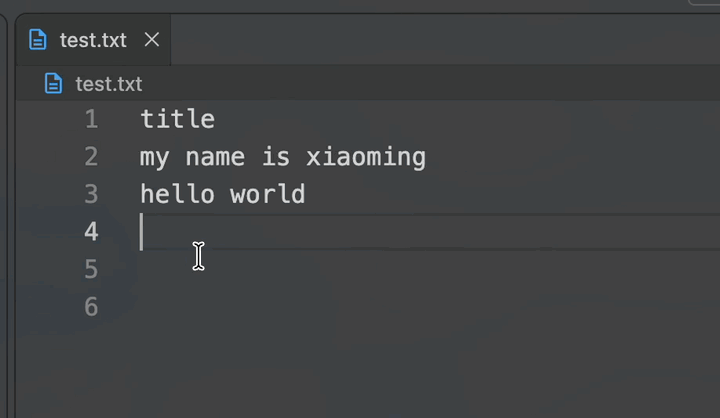

<div align="center">
  
  <h1>ClipRecall</h1>
  <p><strong>macOS 剪贴板历史与顺序粘贴</strong></p>
  <p>留住复制过的内容，快速查找、重新粘贴，或按顺序逐条输出。</p>
  <p>macOS 14+ · Swift 6 · 本地运行</p>
</div>

## 演示

[](Jietu20260924-153912-HD.mp4)

[播放完整演示视频（MP4）](Jietu20260924-153912-HD.mp4)

## 功能

- 菜单栏常驻入口，查看和搜索剪贴板历史。
- 保存文本、HTML、RTF、RTFD、PNG 和 TIFF 内容，支持删除与清空。
- 收集多条内容，并按复制顺序全部粘贴或逐条粘贴。
- 全局快捷键：`⌘⇧V` 打开面板、`⌘⇧C` 开始/结束收集、`⌘⇧P` 按序粘贴。
- 可录制快捷键、设置序列分隔符，并调整粘贴顺序。

历史记录目前只保存在内存中，退出应用后会清空；截图 OCR、持久化和 JSON/Markdown 转换尚未实现。

## 快速开始

```bash
swift run ClipboardApp
```

也可以构建应用包，再在辅助功能设置中授权：

```bash
./Scripts/build-app.sh
open ClipboardApp.app
```

首次使用按序粘贴时，需要在“系统设置 → 隐私与安全性 → 辅助功能”中允许应用发送键盘事件。

## 操作指南

### 普通剪贴板历史

1. 在终端运行 `swift run ClipboardApp`，保持这个进程运行。
2. 查看 macOS 顶部菜单栏，找到剪贴板图标。
3. 在任意应用中复制文本或图片。
4. 点击菜单栏剪贴板图标，历史记录会显示在浮层中。
5. 点击某条记录右侧的粘贴按钮，即可把该记录粘贴到当前应用。

### 多内容收集与按序粘贴

当前版本支持菜单栏和全局快捷键两种操作方式：

1. 点击菜单栏中的剪贴板图标。
2. 点击底部的“开始收集”按钮。按钮变成橙色“结束收集”，标题会显示“序列收集中”。
3. 关闭浮层，切换到需要复制内容的应用。
4. 依次复制第一段、第二段、第三段内容。每次复制后等待约半秒，确保监听器完成记录。
5. 再次点击菜单栏剪贴板图标，确认标题显示“已收集 3 条”等数量。
6. 切换到目标应用，让目标输入框获得焦点。
7. 再次点击菜单栏剪贴板图标，点击底部的“按序粘贴”。工具会关闭浮层、恢复目标应用，并按复制顺序逐条发送粘贴。

也可以使用全局快捷键：

- `⌘⇧V`：打开或隐藏剪贴板面板。
- `⌘⇧C`：开始或结束序列收集。
- `⌘⇧P`：按顺序粘贴已收集内容。

面板现在是普通窗口，可以拖动标题栏移动，点击左上角关闭按钮关闭，点击黄色按钮最小化；关闭或最小化不会结束收集，快捷键仍然有效。

### 设置快捷键、分隔符和桌面状态栏

1. 打开剪贴板面板，点击右下角的“更多”按钮。
2. 点击“打开设置”。
3. 在“快捷键”区域点击某个快捷键框，再按下新的组合键；需要包含 Command、Control 或 Option 中至少一个修饰键。
4. 新快捷键会立即生效，并保存到本机设置。
5. 在“序列粘贴”中选择内容分隔符。默认是“无分隔符”，也可以选择空格、换行或自定义文本。
6. 在“序列粘贴”中选择“全部粘贴”或“逐条粘贴”。逐条模式会保留每条内容自己的换行、富文本和图片格式。
7. 开启“粘贴前显示顺序候选框”后，第一次粘贴会显示带编号的候选列表，可用上移/下移调整顺序；不调整时默认按复制顺序执行。
8. 打开“显示桌面快捷状态栏”后，桌面顶部会显示“正在收集 · N 条”；关闭收集后显示“未收集”。

桌面状态栏默认关闭，菜单栏中的“剪贴板”入口始终保留。快捷键冲突时，系统可能不会注册该组合键，可以回到设置录制另一组。

在“更多”菜单中点击“退出程序”可以完全关闭应用，停止剪贴板监听和全局快捷键。

例如，要按顺序粘贴 `苹果`、`香蕉`、`橙子`：

```text
开始收集 → 复制苹果 → 复制香蕉 → 复制橙子 → 打开菜单栏面板 → 按序粘贴
```

收集完成后点击“结束收集”可以取消本轮收集。已经收集的内容仍会保留在普通历史中，但不会继续参与下一轮序列。

### 多内容收集失败排查

- **快捷键没有反应**：确认运行的是最新的 `ClipboardApp.app`，并重新执行 `./Scripts/build-app.sh`；到“打开设置”中重新录制一组不冲突的快捷键。
- **菜单栏没有图标**：确认 `ClipboardApp.app` 或 `swift run ClipboardApp` 仍在运行；如果终端被 `Ctrl+C` 终止，需要重新启动。
- **点击后仍显示“开始收集”**：说明没有成功点击按钮，重新打开菜单栏浮层后再点击一次，确认按钮变成橙色。
- **收集数量一直是 0**：必须在点击“开始收集”之后重新执行复制；已经存在的历史不会自动加入当前序列。复制后等待约半秒再查看数量。
- **复制内容没有进入历史**：使用 `Cmd+C` 进行实际复制，不要只选择文本；当前监听器只读取系统剪贴板中的文本、HTML、RTF、RTFD、PNG 和 TIFF 类型。
- **按序粘贴没有反应**：在“系统设置 → 隐私与安全性 → 辅助功能”中添加并允许 `ClipboardApp.app`，然后重新启动应用。
- **内容粘贴到了错误位置**：重新打开菜单栏面板前，先让目标应用的输入框获得焦点。当前版本会记住最近的目标应用，但不会自动寻找目标输入框。
- **重复启动导致状态混乱**：先退出旧的 `ClipboardApp` 进程，再执行一次 `./Scripts/build-app.sh && open ClipboardApp.app`。

当前序列只保存在内存中，应用退出后会清空；快捷键自定义、持久化历史和自动 OCR 尚未接入。

## 项目规划与技术方案

以下章节记录后续规划，不代表当前版本已经实现。

### 1. 可行性结论

### 1.1 推荐路线：先做 macOS 原生版本

第一版推荐使用 **Swift + SwiftUI/AppKit**，最低支持 macOS 14。原因如下：

- `NSPasteboard` 可以读取文本、RTF、HTML、图片等类型。
- Vision 框架提供系统级 OCR，无需自带模型。
- ScreenCaptureKit 可以获取屏幕内容。
- SwiftUI 适合设置页和历史列表，AppKit 适合菜单栏、浮层和系统事件处理。
- 原生实现对系统权限、能耗、启动项和沙盒行为的控制更直接。

Rust 可以作为未来跨平台版本的核心数据层，但不建议作为 macOS 第一版的主要 UI 和系统集成语言。剪贴板、屏幕捕获、全局快捷键和辅助功能事件最终仍需要调用平台 API，过早引入 FFI 会增加开发和调试成本。

### 1.2 可行性与限制

| 能力 | 可行性 | 主要限制 |
| --- | --- | --- |
| 监听普通复制 | 高 | 通过轮询 `changeCount`，不同应用的剪贴板行为存在差异 |
| 保存文本、图片、HTML、RTF | 高 | 部分应用只写入自定义 UTI 或临时数据 |
| 粘贴为纯文本/图片 | 高 | 需要根据目标应用支持的格式选择数据 |
| JSON/Markdown 转换 | 中高 | JSON 需要明确输入规则；富文本转 Markdown 无法保证完全还原 |
| 多条内容顺序粘贴 | 中高 | 需要辅助功能权限模拟 `Cmd+V`，还要处理焦点和粘贴延迟 |
| 截图 OCR | 高 | 需要屏幕录制权限；复杂背景、低分辨率和手写文字会降低准确率 |
| 毫秒级体验 | 部分可行 | 内部读取可低延迟，但 OCR、跨应用粘贴和系统权限不应承诺固定毫秒数 |

### 1.3 产品边界

1. 工具不能保证任意应用一次性接收所有序列内容。序列粘贴的实现方式是逐条写入系统剪贴板、模拟一次粘贴，再处理下一条。
2. 监听剪贴板时默认只在本机保存内容，并提供暂停监听、历史上限和自动清理。
3. 密码管理器、银行应用等敏感内容可能不允许读取，或会主动清空剪贴板。工具不能绕过应用安全策略。
4. Markdown 和 JSON 是转换输出格式，不承诺对所有来源格式无损解析。

## 2. 产品目标

### 2.1 核心目标

- 常驻菜单栏，启动快、占用低、无主窗口也能工作。
- 复制后尽快完成剪贴板快照，不阻塞用户正常使用 `Cmd+C` / `Cmd+V`。
- 支持文本、富文本、HTML、图片和可扩展的自定义 UTI。
- 支持普通模式和序列收集模式。
- 支持快捷键唤起历史、搜索历史、选择格式并粘贴。
- 提供截图 OCR，并允许把识别结果复制为文本或加入序列。

### 2.2 非目标

- 第一版不做 Windows/Linux 支持。
- 第一版不做云同步、账号体系或远程上传。
- 第一版不承诺完整的任意格式互转。
- 第一版不替代密码管理器，也不主动抓取受保护的系统内容。

## 3. 使用场景与交互

### 3.1 普通模式

1. 用户在任意应用执行复制。
2. 工具检测到剪贴板变化并创建一条历史记录。
3. 用户通过快捷键打开历史面板。
4. 用户选择记录后直接粘贴，或选择纯文本、图片、Markdown、JSON 等输出格式。

### 3.2 序列收集模式

1. 用户按下“开始序列收集”快捷键。
2. 工具显示轻量状态浮层，不抢占当前输入焦点。
3. 用户连续执行多次复制，工具按时间顺序保存内容。
4. 用户按下序列粘贴快捷键。
5. 工具按顺序逐条粘贴，并在每条之间等待目标应用完成处理。
6. 粘贴完成后退出收集模式，按设置恢复用户原来的剪贴板内容或保留最后一条。

序列模式必须有明确的取消快捷键和超时自动结束机制，避免用户忘记退出后持续收集敏感内容。

### 3.3 截图 OCR 模式

1. 用户按下 OCR 快捷键。
2. 工具获取当前屏幕画面并显示区域选择层。
3. 用户框选文字区域。
4. Vision 识别文字并按行排序。
5. 用户可以复制全部文本、选择某一段、加入序列或重新识别。

第一版先提供“框选区域识别全部文字”，不做复杂的逐字编辑器。逐词选择作为第二阶段能力。

## 4. 技术方案

### 4.1 技术栈

- 语言：Swift 6，启用严格并发检查。
- UI：SwiftUI；菜单栏和系统浮层使用 AppKit。
- 剪贴板：AppKit `NSPasteboard`。
- OCR：Vision `VNRecognizeTextRequest`。
- 屏幕捕获：ScreenCaptureKit。
- 快捷键：优先使用 Carbon `RegisterEventHotKey`，第一版不引入不必要的第三方依赖。
- 持久化：MVP 使用 SwiftData；内容索引和大图片管理复杂后再评估 SQLite。
- 图片压缩：ImageIO，缩略图与原图分开保存。
- 测试：XCTest；跨应用行为使用手工验收脚本补充。

### 4.2 推荐架构

```text
ClipboardApp
├── App                  菜单栏生命周期、依赖注入、权限检查
├── ClipboardMonitor     剪贴板变化监听与快照
├── ClipboardStore       历史记录、索引、清理策略
├── ClipboardFormats     UTI 检测、格式转换、粘贴数据生成
├── SequenceMode         序列收集状态机与顺序粘贴
├── HotKey               全局快捷键注册与冲突提示
├── OCR                  截图、区域选择、Vision 识别、文本排序
├── PasteController      焦点检查、辅助功能事件、粘贴节奏控制
└── UI                   菜单栏、历史面板、设置页、OCR 选择层
```

模块之间通过协议通信，系统 API 尽量集中在基础设施层，便于单元测试和未来替换实现。

### 4.3 剪贴板监听策略

监听器以较低频率检查 `NSPasteboard.general.changeCount`。发现变化后立即在后台读取可用类型，生成不可变快照，再交给存储层。

- 空闲时使用较低轮询频率，检测到变化后短暂提高频率。
- 不在主线程执行图片编码、HTML 解析或数据库写入。
- 对相同内容做指纹去重，避免应用反复写入造成历史膨胀。
- 保留原始数据类型，同时生成可搜索的文本预览。
- 读取失败时记录原因并跳过，不影响系统剪贴板继续工作。

剪贴板监听必须可暂停，并在设置中提供敏感内容保护、自动不保存规则和立即清空历史入口。

### 4.4 数据模型

```text
ClipboardItem
- id: UUID
- createdAt: Date
- sourceAppBundleId: String?
- contentKind: text | image | richText | html | mixed | unknown
- availableTypes: [UTType identifier]
- plainTextPreview: String?
- rawPayloadReference: String
- byteSize: Int
- fingerprint: String
- isSensitive: Bool
- expiresAt: Date?
```

原始内容不直接塞入列表对象。文本和小型数据可以存数据库；图片、HTML 和较大 payload 使用应用容器中的文件，并由记录保存引用。所有历史记录都应有大小上限和过期清理策略。

### 4.5 格式策略

输出格式应采用显式转换器，而不是根据字符串猜测：

- 纯文本：优先读取 `public.utf8-plain-text`。
- 富文本：保留 RTF/RTFD，并可降级为纯文本。
- HTML：保留 HTML，同时提供去标签纯文本。
- 图片：保留原始图片类型，粘贴时生成目标应用可接受的 TIFF/PNG 表示。
- JSON：只接受有效 JSON；展示时格式化，粘贴时可选择压缩或美化。
- Markdown：优先保留来源 Markdown；HTML/RTF 转 Markdown 只提供尽力而为的结果，并明确可能丢失样式。

格式转换失败时必须回退到原始格式或纯文本，并向用户给出非阻塞提示。

### 4.6 序列粘贴状态机

```text
Idle
  -> Collecting     开始序列快捷键
Collecting
  -> Collecting     捕获新的剪贴板内容
Collecting
  -> Pasting        序列粘贴快捷键
Collecting
  -> Idle           取消、超时或应用退出
Pasting
  -> Pasting        当前条目完成，进入下一条
Pasting
  -> Idle           全部完成或发生不可恢复错误
```

粘贴控制器必须：

- 在开始前保存当前剪贴板快照和前台应用信息。
- 检查辅助功能权限；缺少权限时停止并引导用户授权。
- 每条内容写入剪贴板后发送一次粘贴事件。
- 使用可配置的最小间隔，并在必要时等待剪贴板或应用状态稳定。
- 支持用户立即取消，取消后不继续发送键盘事件。
- 完成后按设置恢复原剪贴板；恢复失败不能覆盖用户刚刚产生的新复制内容。

## 5. 权限与安全

可能需要的系统权限：

- 屏幕录制：截图 OCR 必需。
- 辅助功能：全局模拟粘贴和部分全局交互必需。
- 开机启动：可选，由用户主动开启。

权限应按功能首次使用时申请，而不是首次启动就集中弹窗。应用不能上传剪贴板内容，日志中禁止记录原文、图片内容、密码和完整 payload。

建议默认值：

- 历史记录保存 7 天，最多 500 条。
- 单条内容默认限制 10 MB，超出后只保留预览或提示用户。
- 序列模式最多 50 条，默认 10 分钟无操作自动结束。
- 提供“一键暂停监听”和“清空全部历史”。

## 6. 性能指标

指标应区分“工具内部耗时”和“跨应用端到端耗时”：

- 普通文本快照：P95 小于 20 ms。
- 小型图片快照：P95 小于 100 ms，编码放到后台线程。
- 历史面板首次展示：P95 小于 100 ms，缩略图延迟加载。
- OCR：不设固定毫秒承诺，目标是常见选区 1 秒内返回首个结果。
- 空闲 CPU：目标低于 1%，轮询策略可配置。
- 常驻内存：目标低于 100 MB，不以牺牲稳定性和数据安全为代价硬性压缩。

所有指标应在真实应用、真实图片和冷启动/热启动两种情况下测量，并记录 macOS 版本、机器型号和数据规模。

## 7. MVP 范围

### 必须完成

- 菜单栏常驻和设置入口。
- 普通文本、HTML、RTF、图片剪贴板监听与历史保存。
- 历史搜索、删除、清空、过期清理。
- 一个全局快捷键打开历史面板。
- 选择历史记录并粘贴为原始格式或纯文本。
- 序列收集、按序粘贴、取消和超时退出。
- 权限引导、暂停监听和本地数据安全策略。

### 第二阶段

- 截图区域 OCR。
- JSON 校验、格式化和 Markdown 输出。
- OCR 结果加入序列。
- 收藏、标签、固定历史。
- 更可靠的目标应用适配和粘贴节奏配置。

### 暂不实现

- 云同步和跨设备历史。
- Windows/Linux 客户端。
- 复杂的逐词 OCR 编辑器。
- 对所有富文本样式的无损 Markdown 转换。

## 8. 开发里程碑

### 阶段一：技术验证

验证 `NSPasteboard` 读取文本、图片、HTML、RTF；验证菜单栏应用生命周期；确认屏幕录制和辅助功能权限的最小流程。

### 阶段二：剪贴板历史

完成数据模型、后台监听、去重、持久化、搜索和历史面板。先保证普通复制粘贴不被影响。

### 阶段三：序列模式

完成状态机、快捷键、逐条粘贴、取消、超时、恢复剪贴板和错误提示。

### 阶段四：OCR 与格式转换

加入区域截图、Vision OCR、JSON/Markdown 转换，并通过样本集评估准确率和失败回退。

### 阶段五：性能与发布

进行内存、CPU、冷启动、权限拒绝、睡眠唤醒、多显示器、深色模式和多应用兼容性测试，最后再处理开机启动、签名、公证和分发。

## 9. 测试与验收

### 单元测试

- UTI 类型识别和优先级。
- 文本、HTML、RTF、JSON、Markdown 转换。
- 内容指纹和重复项去重。
- 序列状态机的开始、追加、取消、超时和完成。
- 历史数量、大小和过期清理。

### 集成测试

- TextEdit、Safari、Finder、备忘录、终端、Xcode 等应用的复制与粘贴。
- 纯文本、富文本、图片和混合类型内容。
- 辅助功能或屏幕录制权限被拒绝、撤销和重新授权。
- 多显示器、系统睡眠唤醒、应用切换和剪贴板快速连续变化。
- 序列粘贴过程中目标应用失去焦点或用户主动取消。

### 验收标准

- 不开启工具时，系统复制粘贴行为不受影响。
- 监听器异常时，应用不会高 CPU 占用或持续弹窗。
- 权限不足时功能明确失败，不发送未经授权的键盘事件。
- 序列内容不乱序、不重复粘贴，取消后不再发送后续事件。
- 清空历史后本地 payload 文件一并删除。
- 应用日志和崩溃信息不包含剪贴板原文。

## 10. UI 设计原则

使用 macOS 原生视觉语言，借鉴 Liquid Glass 的层次感，但不把模糊和装饰放在功能之前：

- 菜单栏入口保持轻量，显示监听状态和序列状态。
- 历史面板优先保证搜索、预览、快捷键导航和快速粘贴。
- 使用材质、透明度、阴影和细微动效表达层级，避免大面积持续动画。
- 支持浅色/深色模式、减少动态效果和高对比度设置。
- 所有状态都提供键盘操作和 VoiceOver 标签。
- OCR 选择层要有清晰边界、取消入口和权限失败提示。

## 11. 风险与应对

| 风险 | 应对 |
| --- | --- |
| 剪贴板内容无法读取 | 保留可用类型，记录诊断信息，不阻断系统复制 |
| 跨应用粘贴速度不稳定 | 可配置间隔，按应用记录兼容性，不承诺固定速度 |
| 辅助功能权限被拒绝 | 在序列粘贴前检查并提供系统设置跳转 |
| 历史泄露敏感信息 | 默认本地存储、自动过期、暂停监听、清空入口和敏感规则 |
| 大图片造成内存增长 | 原图文件化、缩略图展示、后台压缩和大小限制 |
| OCR 结果错误 | 提示用户校对，保留重新识别和手动复制 |
| 多显示器坐标错误 | 统一屏幕坐标转换，并覆盖 Retina 与多显示器测试 |

## 12. 第一批任务清单

1. 创建 macOS 菜单栏应用工程，确认最低系统版本和签名方式。
2. 定义 `ClipboardItem`、`ClipboardStore`、`ClipboardMonitor` 协议。
3. 实现 `changeCount` 监听和文本快照，先不做 UI 装饰。
4. 接入历史持久化、去重和过期清理。
5. 实现菜单栏历史面板及第一个全局快捷键。
6. 实现原始格式/纯文本粘贴，并在 TextEdit、Safari、终端验证。
7. 实现序列模式状态机和可取消的逐条粘贴。
8. 加入图片、HTML、RTF，再扩展 JSON、Markdown 转换。
9. 最后接入截图 OCR、性能测试和发布流程。

第一阶段完成的判定标准是：用户可以在 TextEdit 和 Safari 中复制文本，工具在后台保存历史，快捷键打开历史并粘贴选中项；系统复制粘贴延迟无明显变化，应用退出后不会残留持续运行的轮询任务。
